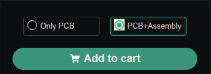
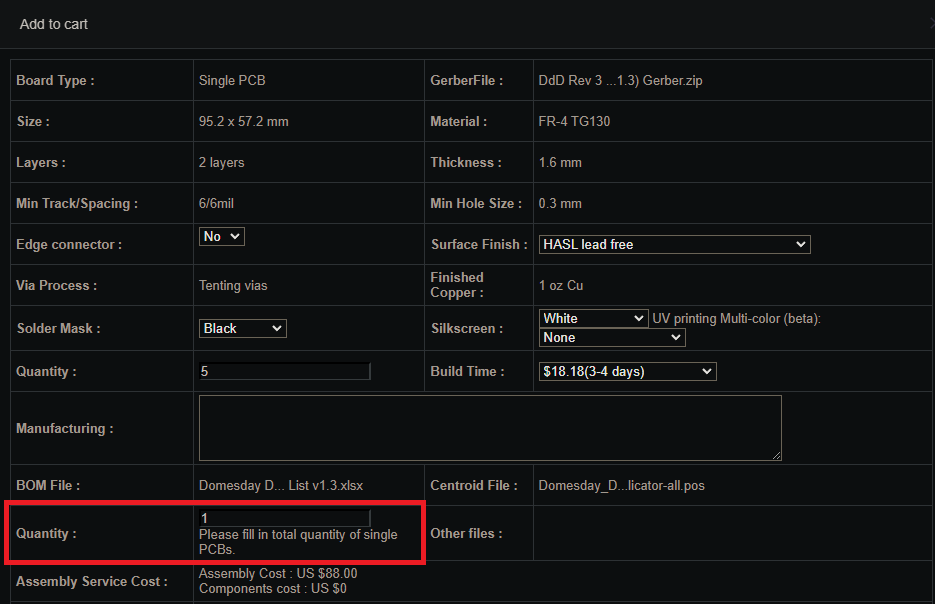
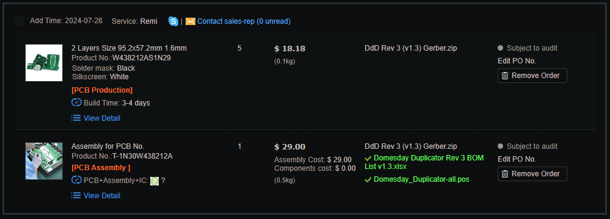
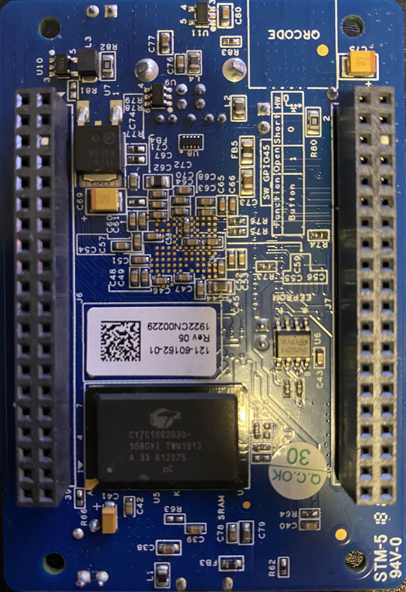
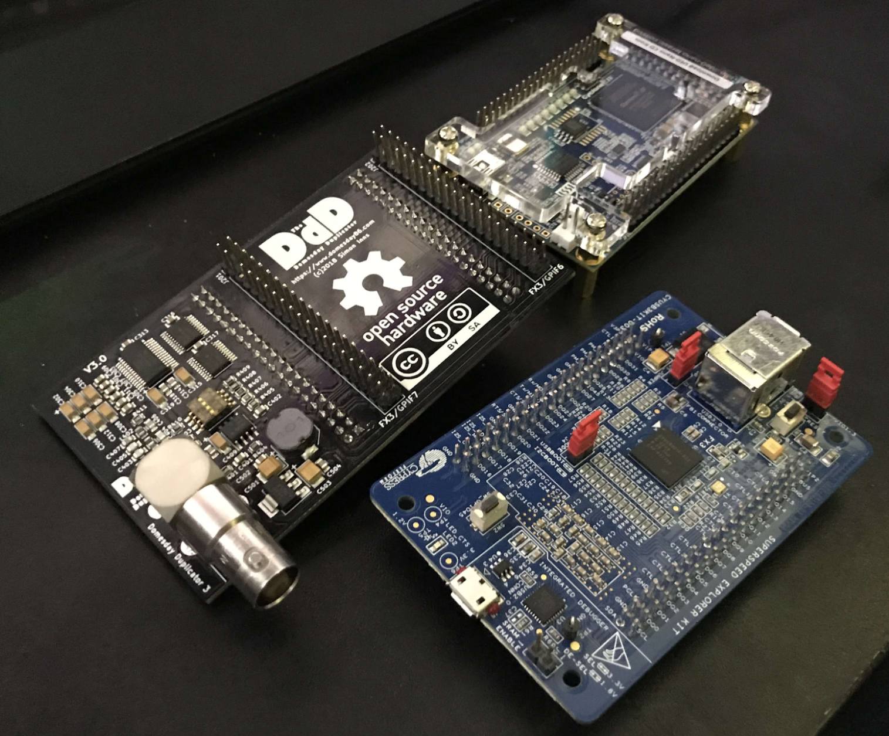
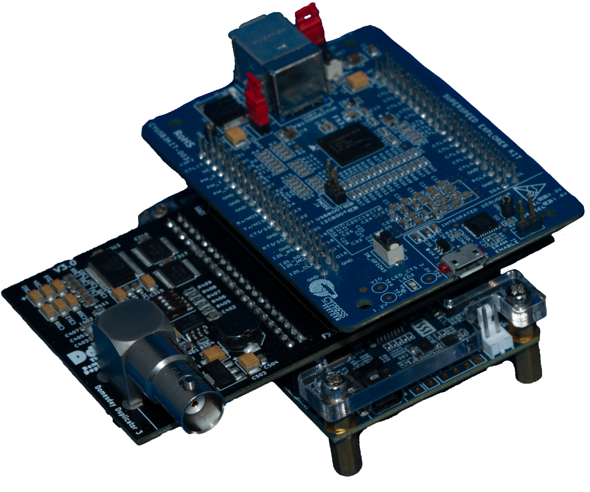

# DomesDay Duplicator

The DdD is a plug-and-play RF capture tool 40msps 10-bit ADS825 ADC & OPA690 amp with a simple capture & control GUI.

Software is built maily for Linux but MacOS is supported alongside Windows support.

# The PCB

Today we have a PCBway shared project that handles all the tehcnical details allowing anyone to have the DdD main PCB fabraicted populated with parts soldered and shipped to them directly at cost with no markup.

`Cost: 90-125USD` (Relative to infaltion & shipping)

`Total Cost: 290-330USD` (upto 350USD if DE0 price is high)

## Step 1

Firstly aquire the 2 off-shelf development boards.

Please do look around, local venders can be cheeper and you can also get these boards a fair bit more cheeper if your with a educational institution or work for one.

[FX3 - Digikey](https://www.digikey.com/en/products/detail/infineon-technologies/CYUSB3KIT-003/4989179?s=N4IgTCBcDaIMIE0CqBlAQgZgNIEkAqAtAAxEYgC6AvkA)

`KIT DEV EZ-USB FX3 USB3.0
428-3347-ND‎
‎CYUSB3KIT-003‎
Cypress Semiconductor Corp`

[DE0 - Digikey](https://www.digikey.com/en/products/detail/terasic-inc/P0082/2625112)

`DE0-NANO EVAL BOARD
‎P0082-ND‎
‎P0082‎
Terasic Inc.`

> [!TIP]  
> - FX3 comes with a USB 3.0 Type-B to Type-A cable.
> - DE0 comes with a USB 2.0 Mini to Type-A cable.

##  Step 2

Go to [PCBway Shared Project](https://www.pcbway.com/project/shareproject/DoomsDayDuplicator_Rev_3.html)

Select `PCB+Assembly`

## Step 3

You will see a order page pop up.

- Selection box 2 (highlighted in RED) should have quantity set to 1 to build a single complete DdD PCB.
- You can change the base PCB colour with changing `solder mask` and text colour with `silkscreen` excluding the UV process options; these have no effect on cost or fabrication.

> [!NOTE]  
> You will have 4 spare extra PCBs with your order, as the mimium you can order is 5 PCBs. 

## Step 4

Wait for parts quote and email conformation.

## Step 5

> [!WARNING]  
> You may encounter a couple issues these will be via email.

- If asked how many layers the PCB is say 2.

- If issue with SRN8040-101M on pad L501, and asked to solder manually say yes, as the part will solder just fine and is for power filtering it's non-critical as long as its got soldered contact that's fine.

- If issues with silkscreen solder bridges tell them to proceed anyways when emailed, as any standard colour change will work just fine and not affect soldering of parts.

Before the PCB has final soldering done and is shipped form PCBway you will get a email with a photo, ensure this looks idential to this image below in terms of parts colour/placement. 

## Step 6

There is 2 2.54mm Headder pins on the DdD PCB that need to be cut flush. 

Marked with RED boxes

This allows the FX3 to fit properly with its blanked out pin slots.

# User Final Assembly 

**Don't assemble the board yet! First, you'll have to get it flashed - no worries, it's really simple.**

- [Windows 10/11 Firmware Flashing Package v2.0](https://drive.google.com/open?id=1uIFqS8PBPw7L4DWuKVc2dPEI4tBV-r3Q&authuser=harry%40opcomedia.com&usp=drive_fs)

The flashing software can be done inside Windows or Linux. 

## Push all PCBs together

Ensure the correct orientation of PCBS and push them together after flashing.

# Conformal Coating

PCBWay charges $100, and it costs $15 for a small jar. I'd recommend picking up some MG Chemicals 422C off amazon or whatever vendor stocks it in your region.

It only takes a few minutes to do a fine coat on the legs of the components.

To quickly dry its surface lift the board on some tin foil balls on a tray at 50°C in a fan oven to set the coating and let fully harden over 48 hours or let it air dry in a clean environment.

I note this for protecting your PCB from dust and contaminatse like hair strands and finger oils.

# 3D Printable Case

The DdD is not immune from stray RF and EMI, a shielded case is ideal to prevent this.

M3 Nuts / Bolts and a screwdriver bit or allen key are required, along with copper tape for shield lining.

You can find SLT files in the `03 3D-Case` folder of this repository.

# Page End

